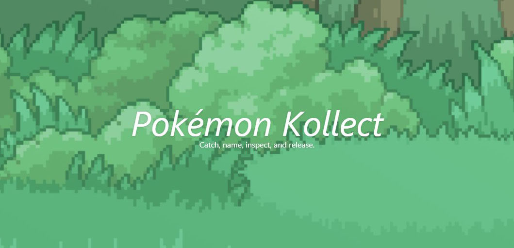

# Pokémon Kollect
[Hosted version on Vercel](https://pokemon-kollect.vercel.app)

A frontend for specific parts of the [PokeApi](https://pokeapi.co/) using:
- [TypeScript](https://www.typescriptlang.org)
- [NextJS](https://nextjs.org)
- [React](https://reactjs.org)
- [Redux Toolkit](https://redux-toolkit.js.org)
- [TailwindCSS](https://tailwindcss.com)

## Features
- Home Page
  - List of all the pokemon you have caught using this site.
  - A button for each pokemon to release it.
  - Links to:
    - A page where you can catch pokemon.
    - A page were you can view a specific pokemon in more detail.
- Catch a Pokemon Page
  - Ten randomly chosen pokemon to catch from.
  - Click a pokemon's image to select it, then click the catch button at the top of the page to name it before catching it.
- Pokemon Detail Page
  - Displays a sprite, stats, and full ability descriptions for the specified pokemon.
- Other
  - Click on the `View Abilities` button found at the bottom of a pokemon's card at any time to view short descriptions of it's abilities.
  - A minor amout of testing.

## Running locally

```bash
npm run dev
# or
yarn dev
```

Open [http://localhost:3000](http://localhost:3000) with your browser to see the result.
